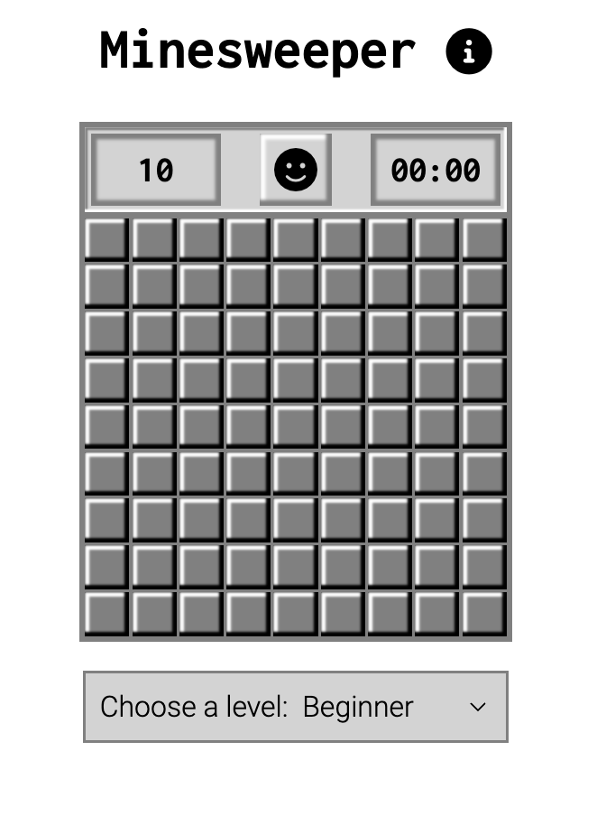
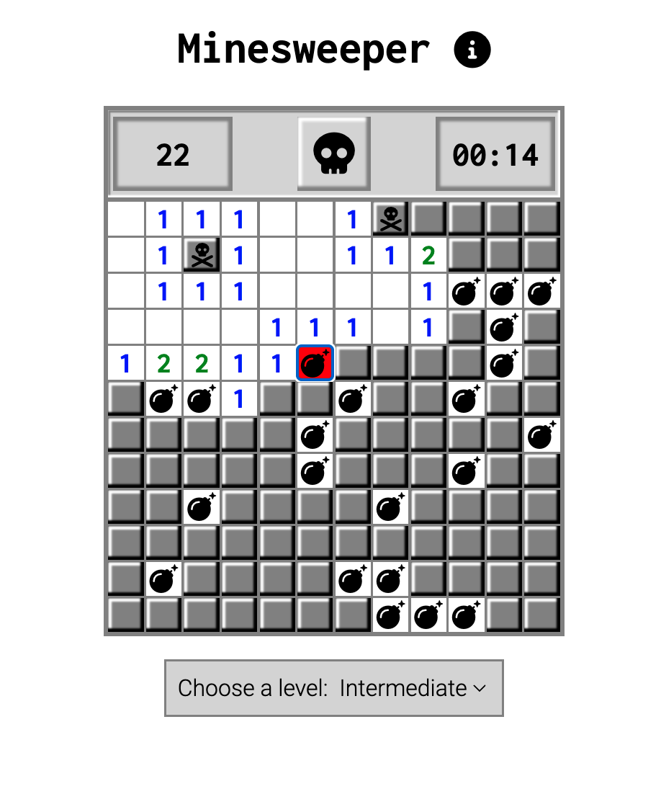

JavaScript minesweeper game with three difficulty levels (only beginner level available in mobile view). Mobile-first approach to styling, using SCSS and BEM.

How to play:
Flag all the hidden mines to win!
If using mouse, left click to reveal a tile and right click to flag a tile.
If using keyboard, use Tab and Shift + Tab to move backwards and forwards through the tiles, Enter to reveal a tile and any other key to flag a tile.
If playing on a phone, short press to reveal a tile and long press to flag a tile.

Screenshots:

